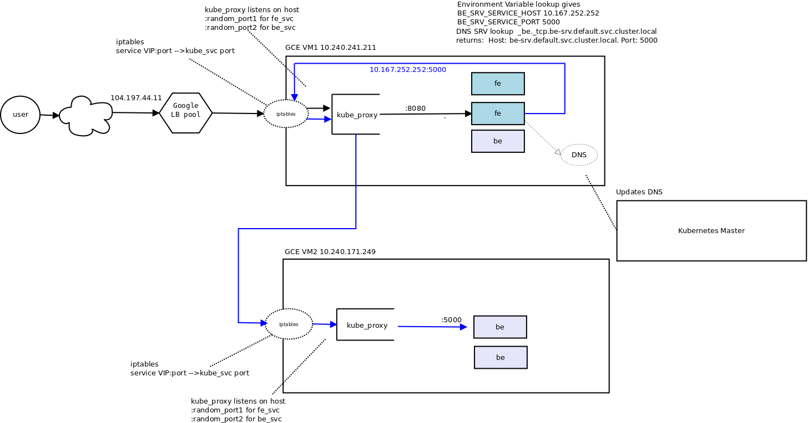
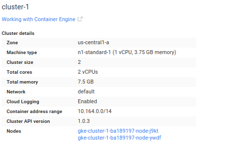
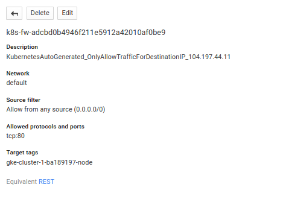
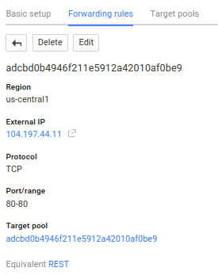
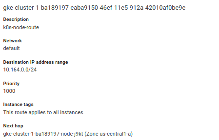
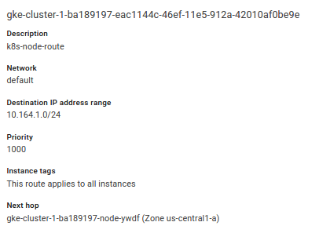

###Kubernetes Services HelloWorld

Sample application that deploys a trivial [Kubernetes service](https://github.com/kubernetes/kubernetes/blob/release-1.0/docs/user-guide/services.md) to connect a frontend system (fe) with a backend (be).  

This is merely to demonstrate Kubernetes service discovery in [Google Container Engine (GKE)](https://cloud.google.com/container-engine/docs/services/), nothing more and is based off the guestbook service example.

Parts of this sample code is from the default kubernetes 'guestbook' example.

HTTP requests to the frontend handler causes a service lookup for the backend and retrieves some data from the backend.  

user --> loadbalancer --> frontend --> lookup backend service --> make backend API call --> return data to fronend --> return web page to user showing some data from the backend.  

####Frontend/backend Services

The frontend consists of a golang program that listens for http requests on port :8080.  It is wrapped in the container  

[salrashid123/fe](https://hub.docker.com/r/salrashid123/fe/)

The frontend service is configured to startup 2 replicas inside a Loaldbalanced Kubernetes service:

**Frontend**
#####Replication Controller
```yaml
apiVersion: v1
kind: ReplicationController
metadata:
  name: fe-rc
  labels:
    type: fe-type
spec:
  replicas: 2
  template:
    metadata:
      labels:
        type: fe-type
    spec:
      containers:
      - name: fe-container
        image: salrashid123/fe
        imagePullPolicy: IfNotPresent
        ports:
        - containerPort: 8080
          protocol: TCP
        env:
        - name: USER_VAR
          value: important information
        - name: POD_NAME
          valueFrom:
            fieldRef:
              fieldPath: metadata.name
        - name: POD_NAMESPACE
          valueFrom:
            fieldRef:
              fieldPath: metadata.namespace

```

#####Frontend Service Definition
```yaml
apiVersion: v1
kind: Service
metadata:
  name: fe-srv
  labels:
    type: fe-type
spec:
  type: LoadBalancer
  ports:
  - name: fe
    port: 80
    protocol: TCP
    targetPort: 8080
  selector:
    type: fe-type
```

####Backend

The backend consists of another golang program which for http requests on port :5000.  It is wrapped in the container  

[salrashid123/be](https://hub.docker.com/r/salrashid123/be/)

Backend uses the advertises the label *be-type* 

#####Replication Controller
```yaml
---
apiVersion: v1
kind: ReplicationController
metadata:
  name: be-rc
  labels:
    type: be-type
spec:
  replicas: 3
  template:
    metadata:
      labels:
        type: be-type
    spec:
      containers:
      - name: be-container
        image: salrashid123/be
        imagePullPolicy: Always
        ports:
        - containerPort: 5000
          protocol: TCP
        env:
        - name: POD_NAME
          valueFrom:
            fieldRef:
              fieldPath: metadata.name
        - name: POD_NAMESPACE
          valueFrom:
            fieldRef:
              fieldPath: metadata.namespace

```


#####Backend Servce Definition
```yaml
apiVersion: v1
kind: Service
metadata:
  name: be-srv
  labels:
    type: be-type
spec:
  ports:
  - name: be
    port: 5000
    protocol: TCP
  selector:
    type: be-type

```

### Discovery

Once a request hits any pod running the frontend service, the front end attempts to discover how to connect to the backend service.  This is done in two ways:  using environment variables or (preferably), by DNS SRV lookups.  
Each node in the cluster runs a local [DNS](https://github.com/kubernetes/kubernetes/tree/master/cluster/addons/dns) server.  

Also see [Kubernetes networking](https://github.com/kubernetes/kubernetes/blob/release-1.0/docs/design/networking.md)

**Environment Variables**
```go
    backendHost := os.Getenv("BE_SRV_SERVICE_HOST")
    backendPort := os.Getenv("BE_SRV_SERVICE_PORT")
    backendRsp, backendErr := http.Get(fmt.Sprintf(
        "http://%v:%v/",
        backendHost,
        backendPort))
    if backendErr == nil {
        defer backendRsp.Body.Close()
    }
```

**DNS SRV**
```go
    cname, rec, err := net.LookupSRV("be", "tcp", "be-srv.default.svc.cluster.local")
    if err != nil {
        http.Error(resp, err.Error(), http.StatusInternalServerError)
    }
    fmt.Fprintf(resp, "SRV CNAME: %v\n", cname)
    for i := range rec {
        fmt.Fprintf(resp, "SRV Records: %v \n", rec[i])
        DNSbackendHost = rec[i].Target
        DNSbackendPort = strconv.Itoa(int(rec[i].Port))
    }
```


###Create Test Cluster
Create the cluster with two nodes in us-central1-a using either gcloud or the Cloud Console
```
gcloud config set compute/zone us-central1-a
gcloud beta container clusters create cluster-1 --num-nodes 2

gcloud compute instances list
NAME                              INTERNAL_IP    EXTERNAL_IP     STATUS
gke-cluster-1-ba189197-node-j9kt  10.240.241.211 173.255.113.167 RUNNING
gke-cluster-1-ba189197-node-ywdf  10.240.171.249 104.197.63.144  RUNNING
```

###Create Replication Controllers and Services

Run thefollowing to create the frontend/backend replication controllers and services.
```
kubectl create -f be-rc.yaml
kubectl create -f be-srv.yaml
kubectl create -f fe-rc.yaml
kubectl create -f fe-srv.yaml
```


####List the nodes
```
kubectl get no
NAME        LABELS                           STATUS
gke-cluster-1-ba189197-node-j9kt   kubernetes.io/hostname=gke-cluster-1-ba189197-node-j9kt   Ready
gke-cluster-1-ba189197-node-ywdf   kubernetes.io/hostname=gke-cluster-1-ba189197-node-ywdf   Ready
```

####List the pods
```
kubectl get po
NAME          READY     STATUS    RESTARTS   AGE
be-rc-ekpb7   1/1       Running   0          2m
be-rc-mud4n   1/1       Running   0          2m
be-rc-qo453   1/1       Running   0          2m
fe-rc-0yv6u   1/1       Running   0          2m
fe-rc-2plu0   1/1       Running   0          2m
```

####List the replication controllers
```
kubectl get rc
CONTROLLER   CONTAINER(S)   IMAGE(S)          SELECTOR       REPLICAS
be-rc        be-container   salrashid123/be   type=be-type   3
fe-rc        fe-container   salrashid123/fe   type=fe-type   2
```

####List the services
```
kubectl get svc
NAME         LABELS           SELECTOR       IP(S)            PORT(S)
be-srv       type=be-type     type=be-type   10.167.252.252   5000/TCP
fe-srv       type=fe-type     type=fe-type   10.167.249.76    80/TCP
                                             104.197.44.11   
kubernetes   component=apiserver,provider=kubernetes 10.167.240.1     443/TCP
```

The above shows the service IP addresses.  Since we're running this on GKE, it will also create a provider-specific commands to generate a public IP, loadbalancer, filewall rules.   

The public IP assigned to our Frontend Loadblancer is:  **104.197.44.11**


###Test the GKE cluster
The frontend service is available **104.197.44.11:80** so an invocation shows:
```
curl http://104.197.44.11/
SRV CNAME: _be._tcp.be-srv.default.svc.cluster.local.
SRV Records: &{be-srv.default.svc.cluster.local. 5000 10 100} 
Pod Name: fe-rc-0yv6u 
Pod Namespace: default 
USER_VAR: important information 

Kubenertes environment variables
BE_SRV_SERVICE_HOST = 10.167.252.252 
BE_SRV_SERVICE_PORT = 5000 
KUBERNETES_SERVICE_HOST = 10.167.240.1 
KUBERNETES_SERVICE_PORT = 443 

Found ENV lookup backend ip: 10.167.252.252 port: 5000
ENV Lookup Response from backend
BACKEND Response
Found DNS lookup backend ip: be-srv.default.svc.cluster.local. port: 5000
DNS Lookup Response from backend
BACKEND Response
```


The above output is from the frontend and shows the backend discovery by both environment variables and DNS SRV.   The response from the backend is just the part **BACKEND Response**.  

The output shows the frontend discovered the backend using envionment variables  IP address/port values:   **10.167.252.252:5000**  

The output also shows the DNS SRV request contained the host and port to connect to from the frontend:  **be-srv.default.svc.cluster.local. port: 5000**


###Call Flow
The following shows the call flow between the the frontend and backend.  

For a detailed description of the proxy and VIPs, see [Kubernetes Services](http://kubernetes.io/v1.0/docs/user-guide/services.html#ips-and-vips)

 

###Automatic configuration on GKE
The firwall, network configuration created for this example are:

 


 

 

 




 


###Extending the sample
If you want to extend the sample, the easiest way is to build the sample an push it to your public dockerhub area where kubernetes can download it.  

Remember to rename the image section to whatever you taged to it.  

You can, ofcourse use [Google Container Registry](https://cloud.google.com/container-registry/)
